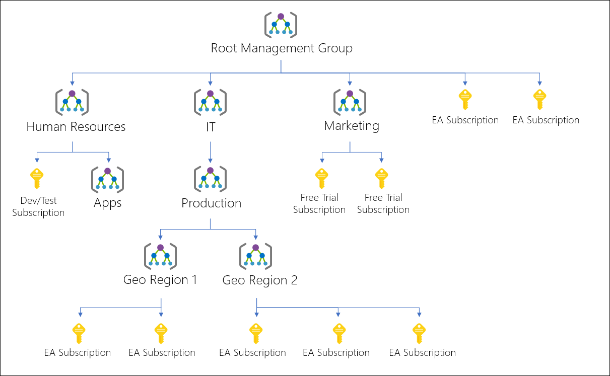

# Azure Policy tester

Goal of this project is to do unit-tests of Azure Policies using the [Golang testing framework](https://pkg.go.dev/testing).

For the sake of this POC, policies are managed as-code using Terraform but you can deploy them the way you want.

⚠️ The code and examples are here for testing purposes, you will need to adapt them to fit with your environment (don't blindly execute this code in your production environment...) ⚠️

The unit tests scenario are coded inside [pkg/resources/resources_test.go](./pkg/resources/resources_test.go).

## How to

Follow these steps to get started.

Depending where you want to deploy the policies in the resources tree, you'll need to adapt the [management_group_id](https://registry.terraform.io/providers/hashicorp/azurerm/latest/docs/resources/policy_definition#management_group_id) in the terraform code.



### Deploy the policies using Terraform

1. Clone this repo
2. Go in the [terraform directory](./terraform)
3. Make sure you have the required Azure credentials to execute the Terraform code
4. `terraform init; terraform plan; terraform apply`

### Run the unit tests

1. Make sure you have the required Azure credentials to execute the tests.
2. Select the subscription you want to run the tests against and execute the tests:

```shell
export AZURE_SUBSCRIPTION_ID=xxxxxxxx-xxxx-xxxx-xxxx-xxxxxxxxxxx
go clean -testcache; go test -p 1 -timeout 30m  -v ./...
```

You should obtain an output similar to this one:

```shell
=== RUN   TestRegionDeployment
=== RUN   TestRegionDeployment/ResourceGroupCreation_->_Brazil_Southeast
=== RUN   TestRegionDeployment/ResourceGroupCreation_->_Switzerland_North
=== RUN   TestRegionDeployment/ResourceGroupCreation_->_Central_US
=== RUN   TestRegionDeployment/ResourceGroupCreation_->_South_Central_US
=== RUN   TestRegionDeployment/ResourceGroupCreation_->_West_Central_US
=== RUN   TestRegionDeployment/ResourceGroupCreation_->_West_US
=== RUN   TestRegionDeployment/ResourceGroupCreation_->_Switzerland_West
=== RUN   TestRegionDeployment/ResourceGroupCreation_->_East_US
=== RUN   TestRegionDeployment/ResourceGroupCreation_->_East_US_2
=== RUN   TestRegionDeployment/ResourceGroupCreation_->_North_Central_US
=== RUN   TestRegionDeployment/ResourceGroupCreation_->_West_US_2
=== RUN   TestRegionDeployment/ResourceGroupCreation_->_West_US_3
--- PASS: TestRegionDeployment (388.15s)
    --- PASS: TestRegionDeployment/ResourceGroupCreation_->_Brazil_Southeast (0.55s)
    --- PASS: TestRegionDeployment/ResourceGroupCreation_->_Switzerland_North (0.26s)
    --- PASS: TestRegionDeployment/ResourceGroupCreation_->_Central_US (17.70s)
    --- PASS: TestRegionDeployment/ResourceGroupCreation_->_South_Central_US (81.02s)
    --- PASS: TestRegionDeployment/ResourceGroupCreation_->_West_Central_US (20.53s)
    --- PASS: TestRegionDeployment/ResourceGroupCreation_->_West_US (21.33s)
    --- PASS: TestRegionDeployment/ResourceGroupCreation_->_Switzerland_West (72.81s)
    --- PASS: TestRegionDeployment/ResourceGroupCreation_->_East_US (16.83s)
    --- PASS: TestRegionDeployment/ResourceGroupCreation_->_East_US_2 (20.15s)
    --- PASS: TestRegionDeployment/ResourceGroupCreation_->_North_Central_US (19.08s)
    --- PASS: TestRegionDeployment/ResourceGroupCreation_->_West_US_2 (81.66s)
    --- PASS: TestRegionDeployment/ResourceGroupCreation_->_West_US_3 (18.41s)
=== RUN   TestNetworkSecurityGroupPolicies
=== RUN   TestNetworkSecurityGroupPolicies/NetworkSecurityRule_SourceAddressPrefix_->_internet_on_port_->_22
=== RUN   TestNetworkSecurityGroupPolicies/NetworkSecurityRule_SourceAddressPrefix_->_*_on_port_->_22
=== RUN   TestNetworkSecurityGroupPolicies/NetworkSecurityGroupRule_SourceAddressPrefix_->_0.0.0.0/0_on_port_->_3389
=== RUN   TestNetworkSecurityGroupPolicies/NetworkSecurityRule_SourceAddressPrefix_->_*_on_port_->_*
=== RUN   TestNetworkSecurityGroupPolicies/NetworkSecurityRule_SourceAddressPrefix_->_*_on_port_->_3389
=== RUN   TestNetworkSecurityGroupPolicies/NetworkSecurityRule_SourceAddressPrefix_->_internet_on_port_->_3389
=== RUN   TestNetworkSecurityGroupPolicies/NetworkSecurityRule_SourceAddressPrefix_->_0.0.0.0/0_on_port_->_22
=== RUN   TestNetworkSecurityGroupPolicies/NetworkSecurityRule_SourceAddressPrefix_->_0.0.0.0/0_on_port_->_3389
=== RUN   TestNetworkSecurityGroupPolicies/NetworkSecurityRule_SourceAddressPrefix_->_192.168.0.0/24_on_port_->_3389
=== RUN   TestNetworkSecurityGroupPolicies/NetworkSecurityGroupRule_SourceAddressPrefix_->_*_on_port_->_3389
=== RUN   TestNetworkSecurityGroupPolicies/NetworkSecurityGroupRule_SourceAddressPrefix_->_internet_on_port_->_3389
=== RUN   TestNetworkSecurityGroupPolicies/NetworkSecurityRule_SourceAddressPrefix_->_192.168.0.0/24_on_port_->_22
=== RUN   TestNetworkSecurityGroupPolicies/NetworkSecurityGroupRule_SourceAddressPrefix_->_*_on_port_->_22
=== RUN   TestNetworkSecurityGroupPolicies/NetworkSecurityGroupRule_SourceAddressPrefix_->_internet_on_port_->_22
=== RUN   TestNetworkSecurityGroupPolicies/NetworkSecurityGroupRule_SourceAddressPrefix_->_0.0.0.0/0_on_port_->_22
=== RUN   TestNetworkSecurityGroupPolicies/NetworkSecurityGroupRule_SourceAddressPrefix_->_192.168.0.0/24_on_port_->_22
=== RUN   TestNetworkSecurityGroupPolicies/NetworkSecurityGroupRule_SourceAddressPrefix_->_192.168.0.0/24_on_port_->_3389
=== RUN   TestNetworkSecurityGroupPolicies/NetworkSecurityGroupRule_SourceAddressPrefix_->_*_on_port_->_*
--- PASS: TestNetworkSecurityGroupPolicies (106.51s)
    --- PASS: TestNetworkSecurityGroupPolicies/NetworkSecurityRule_SourceAddressPrefix_->_internet_on_port_->_22 (0.14s)
    --- PASS: TestNetworkSecurityGroupPolicies/NetworkSecurityRule_SourceAddressPrefix_->_*_on_port_->_22 (0.11s)
    --- PASS: TestNetworkSecurityGroupPolicies/NetworkSecurityGroupRule_SourceAddressPrefix_->_0.0.0.0/0_on_port_->_3389 (0.13s)
    --- PASS: TestNetworkSecurityGroupPolicies/NetworkSecurityRule_SourceAddressPrefix_->_*_on_port_->_* (0.12s)
    --- PASS: TestNetworkSecurityGroupPolicies/NetworkSecurityRule_SourceAddressPrefix_->_*_on_port_->_3389 (0.12s)
    --- PASS: TestNetworkSecurityGroupPolicies/NetworkSecurityRule_SourceAddressPrefix_->_internet_on_port_->_3389 (0.11s)
    --- PASS: TestNetworkSecurityGroupPolicies/NetworkSecurityRule_SourceAddressPrefix_->_0.0.0.0/0_on_port_->_22 (0.11s)
    --- PASS: TestNetworkSecurityGroupPolicies/NetworkSecurityRule_SourceAddressPrefix_->_0.0.0.0/0_on_port_->_3389 (0.10s)
    --- PASS: TestNetworkSecurityGroupPolicies/NetworkSecurityRule_SourceAddressPrefix_->_192.168.0.0/24_on_port_->_3389 (10.42s)
    --- PASS: TestNetworkSecurityGroupPolicies/NetworkSecurityGroupRule_SourceAddressPrefix_->_*_on_port_->_3389 (0.14s)
    --- PASS: TestNetworkSecurityGroupPolicies/NetworkSecurityGroupRule_SourceAddressPrefix_->_internet_on_port_->_3389 (0.12s)
    --- PASS: TestNetworkSecurityGroupPolicies/NetworkSecurityRule_SourceAddressPrefix_->_192.168.0.0/24_on_port_->_22 (10.37s)
    --- PASS: TestNetworkSecurityGroupPolicies/NetworkSecurityGroupRule_SourceAddressPrefix_->_*_on_port_->_22 (0.13s)
    --- PASS: TestNetworkSecurityGroupPolicies/NetworkSecurityGroupRule_SourceAddressPrefix_->_internet_on_port_->_22 (0.28s)
    --- PASS: TestNetworkSecurityGroupPolicies/NetworkSecurityGroupRule_SourceAddressPrefix_->_0.0.0.0/0_on_port_->_22 (0.13s)
    --- PASS: TestNetworkSecurityGroupPolicies/NetworkSecurityGroupRule_SourceAddressPrefix_->_192.168.0.0/24_on_port_->_22 (0.38s)
    --- PASS: TestNetworkSecurityGroupPolicies/NetworkSecurityGroupRule_SourceAddressPrefix_->_192.168.0.0/24_on_port_->_3389 (3.37s)
    --- PASS: TestNetworkSecurityGroupPolicies/NetworkSecurityGroupRule_SourceAddressPrefix_->_*_on_port_->_* (0.12s)
PASS
```

### Notes

* The [main.go](main.go) file is not used when running the tests, it is just a placeholder to test the Azure Resource creation process when coding new tests.
